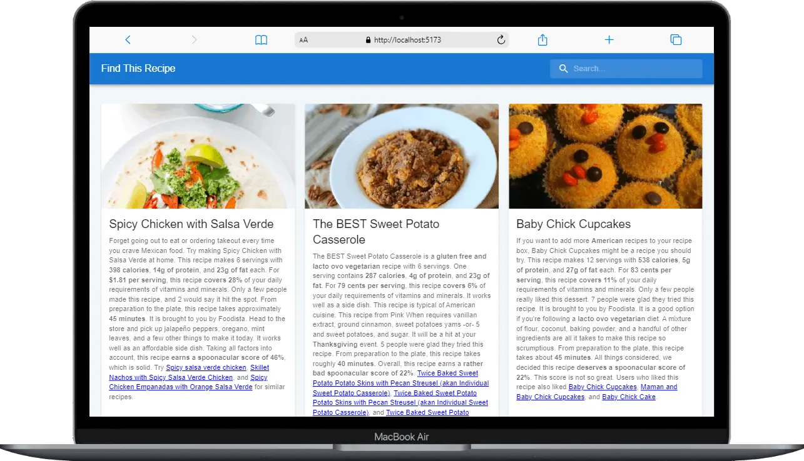
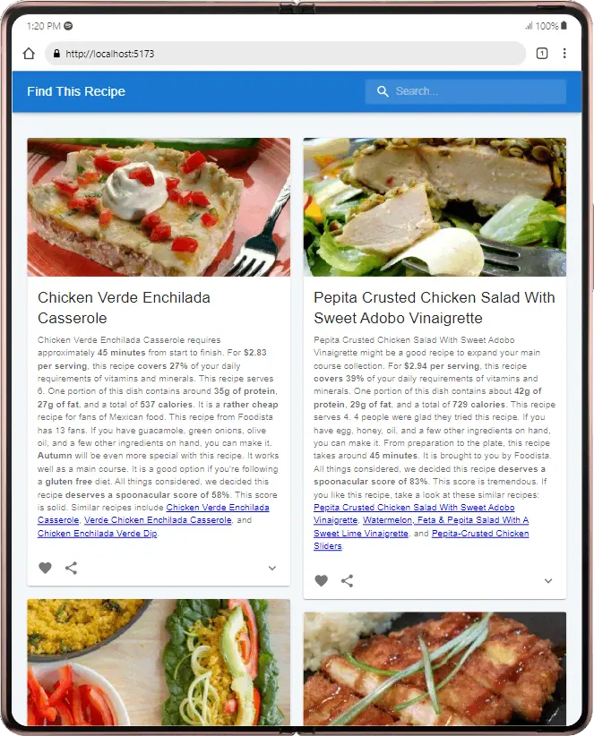
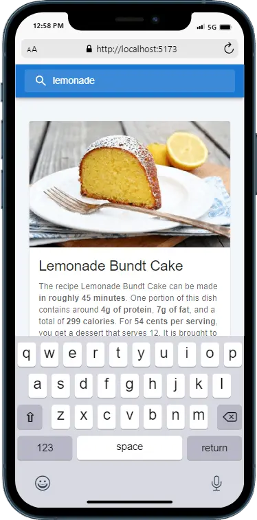

# Create find this recipe using spooncular api and material ui

# Features

- responsive design
- search recipe with max results 10 response
- showing recipe with picture description and instructions
- parsing html tag from api and convert to react app
- adding the debouncing search method
- skeleton mode if the image doesn't exist

# Screenshot

# Demo

[Demo link](https://find-this-recipe.vercel.app/)
